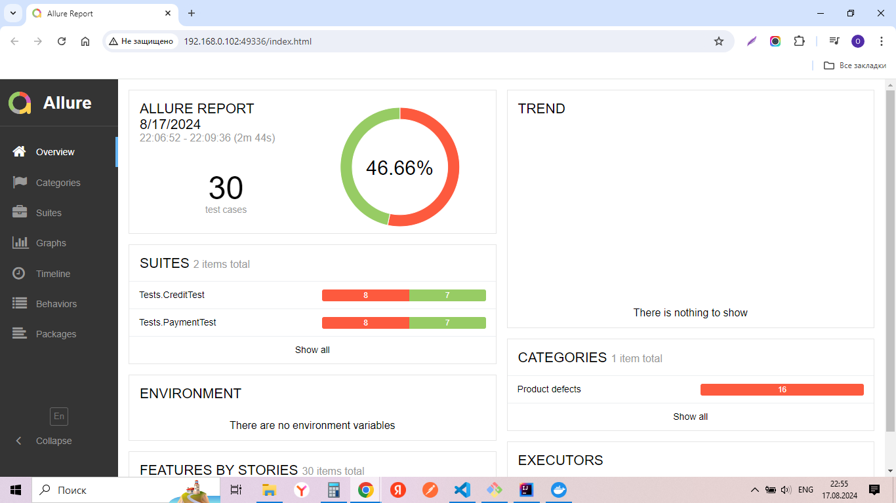

# Отчет по итогам тестирования

## Краткое описание

Было проведено автоматизированное тестирование позитивных и негативных сценариев покупки тура.
Предварительно было проведено исследовательское тестирование для ознакомления с проектом.
Согласно задаче были написаны тесты UI

## Результаты тестирования

- Всего тест-кейсов: 30
- Успешных: 14 (46,66%)
- Не успешных: 16 (53,33%)
  

*Найденные баги:*

1. [Возможность в поле "Владелец" ввести Имя состоящее из одного слова](https://github.com/Olga-Belova33/DiplomBelovaQA/issues/1);
2. [Возможность в поле "Месяц" ввести значение 00](https://github.com/Olga-Belova33/DiplomBelovaQA/issues/2);
3. [Возможность в поле "Владелец" ввести спецзнаки ](https://github.com/Olga-Belova33/DiplomBelovaQA/issues/3);
4. [Возможность в поле "Владелец" ввести Имя на кириллице](https://github.com/Olga-Belova33/DiplomBelovaQA/issues/4);
5. [Вывод на экран сообщений ОШИБКА и затем УСПЕШНО при вводе данных несуществующей карты](https://github.com/Olga-Belova33/DiplomBelovaQA/issues/5);
6. [Вывод на экран сообщения УСПЕШНО при оплате картой со статусом Diclane](https://github.com/Olga-Belova33/DiplomBelovaQA/issues/6);

## Общие рекомендации

Исправить найденные баги, отраженные в [Issues]() 